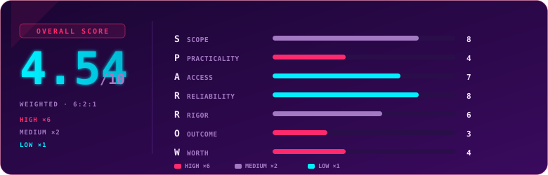

  

  
  
  
  

---

## Overview

> [!NOTE]
> **TL;DR** — A well-sequenced, incident-driven intro to defending AWS across IAM, networking, compute, and storage. The real-world breach framing in every room is genuinely strong. The labs are the weak part: nearly every remediation hands you the exact commands to paste, then a verifier Lambda hands back a flag, so there's almost no investigation or problem-solving. Solid as bundled learning for a newcomer to cloud defense. Hard to justify as a standalone paid product, and trivially easy for anyone past beginner.

  

  Use code <code>KAROL20</code> on <a href="https://tryhackme.com/"><b>TryHackMe</b></a> or <a href="https://tryhackme.com/certifications?view=bundles"><b>BUNDLES</b></a> for 20% off

## Path Parameters

| | |
|---|---|
| Platform | TryHackMe |
| Format | Learning Path (guided rooms, no proctored exam) |
| Modules | 5 (Welcome to AWS, IAM, Network & Perimeter Defense, Securing Compute, Storage & Data Security) |
| Difficulty | Easy throughout |
| Duration | ~15h30m of course time |
| Access model | Included with a TryHackMe subscription |
| Completions | ~100 at time of review (path is new, released 2026) |

## Terrain

The path walks the defensive side of AWS, one misconfiguration at a time: over-privileged IAM users and roles, forgotten access keys, silent IAM changes, wide-open security groups, mislabeled "private" subnets, forgotten NACLs, missing VPC Flow Logs, exposed management ports, unpatched instances, IMDSv1 credential theft, oversharing containers, leaky and unencrypted and unlogged S3 buckets, and public EBS snapshots.

Every room follows the same rhythm: Introduction, a real-world incident, Identification, Remediation, Build It Securely, Conclusion. That structure is the path's biggest strength and, eventually, its biggest tell. It's predictable and easy to follow, but after a few rooms you know exactly what each task will ask before you read it.

## Mission Debrief

The best thing here is the incident framing. Each room is anchored to a genuine breach that maps directly onto the misconfiguration being taught: Code Spaces, Uber, Capital One, Ubiquiti, the MongoDB Apocalypse, Tesla, SCARLETEEL, Marriott, TeamTNT, WannaCry, Shopify, Hildegard, LastPass, the Verizon/Dow Jones/Pegasus S3 leaks, Chegg, and the Bishop Fox DEF CON snapshot research. The write-ups are accurate, well-chosen, and they make the "why this matters" land in a way a lot of AWS training skips.

The teaching content is clean. If you genuinely don't know how an IAM policy is evaluated, why a subnet is public because of its route table and not its name, or what SSE-KMS adds over SSE-S3, you will come out understanding those things.

The labs are where it falls down. The Identification tasks have some value, you do run real CLI commands to find the flaw. But the Remediation and Build It Securely tasks almost always hand you the exact commands to paste, and completion is checked by a verifier Lambda that seeds a flag on success. The flags themselves are usually sitting in an EC2 tag or a container environment variable, retrieved by a command the room gives you. There is very little "figure out what's wrong and fix it," which is the part that would make defensive training stick.

## Friction Points

> [!WARNING]
> The friction is mild and all of it is normal AWS-lab behavior, not broken content: patch state reads empty until the scan reaches `Success` (poll first), a `SG_ID` saved in one CloudShell session goes stale in the next (re-fetch IDs), a verifier that checks resources by `Name` tag fails until you tag your NACLs, and IMDSv1-issued credentials stay valid for up to 6 hours after you enforce IMDSv2. None of it blocks progress, but it's worth knowing before it surprises you.

## Debrief Accounting

Where this path earns its keep: the incident library, the clean concept explanations, and the fact that defensive AWS is genuinely under-served compared to the offensive side. Where it doesn't: the labs are copy-paste with a verifier, the difficulty never rises above easy, and the underlying knowledge is fully reconstructable from free sources (AWS documentation plus the public breach reports the path itself links to).

## S.P.A.R.R.O.W. Score

| Letter | Dimension | Weight | Score | Reasoning |
|:---:|---|:---:|:---:|---|
| **S** | Scope | ×2 | 8 | It advertises defensive coverage across IAM, networking, compute, and storage, and it delivers that breadth. |
| **P** | Practicality | ×6 | 4 | Remediation is pasting the commands the room supplies, so there's almost no real problem-solving. |
| **A** | Access | ×1 | 7 | As teaching material it's clean and well-sequenced, with strong real-world context. |
| **R** | Reliability | ×1 | 8 | Labs provisioned, SSM and verifiers worked; the only friction is ordinary AWS-lab timing quirks. |
| **R** | Rigor | ×2 | 6 | The auto-grading checks the actual configuration state so it's fair and consistent, but it demands very little. |
| **O** | Outcome | ×6 | 3 | A path-completion certificate carries almost no hiring signal; the knowledge is the value, not the paper. |
| **W** | Worth | ×6 | 4 | The knowledge is fully available for free in structured form (AWS docs plus the linked breach reports), which caps its standalone value even at a low price. |

### Overall score: 4.54 / 10

| Tier | Weight | Scores | Weighted subtotal |
|---|:---:|---|:---:|
| High | ×6 | Practicality 4, Outcome 3, Worth 4 → sum 11 | 66 |
| Medium | ×2 | Scope 8, Rigor 6 → sum 14 | 28 |
| Low | ×1 | Access 7, Reliability 8 → sum 15 | 15 |

`(66 + 28 + 15) / 24 = 109 / 24 = 4.54`

> [!TIP]
> The shape tells the story: strong on the low-weight and Scope dimensions (it teaches real things reliably), weak on the three high-weight ones (Practicality, Outcome, Worth). A 4.54 lands just below an entry-level cert like SEC0, which is the honest read. Good bundled learning, weak standalone product.

## Verdict

Do it if it's already in your subscription and you want a clean, incident-driven tour of defending AWS. The breach framing alone is worth the afternoon. Don't pay for it separately, and don't expect it to challenge you if you're past beginner. The path treats "run this command and watch it pass" as hands-on when it's really guided reading with a terminal attached. That's fine for a first exposure, but it's the ceiling here, not the floor.

## Lessons Learned

- The single most transferable idea across the whole path: in AWS, **identity, data, and configuration are always yours to secure**, and the same three failures recur everywhere (over-permissive access, public exposure, missing logging).
- **IMDSv2, Block Public Access, SSE-KMS, and taskRoleArn** are the four controls that show up again and again as the specific fix that breaks a real attack chain.
- Defensive value comes from **investigation**, and that's exactly what a copy-paste lab format can't teach. The incident write-ups carry this path, not the exercises.

## Certificate

  

  

### My Result

Completed the full path (all 5 modules, ~19 rooms). Course time ~15h30m, though the actual hands-on time is much shorter since most tasks are guided. Overall feel: **thorough but sleepy**. The incidents kept me reading; the labs did not keep me thinking.

---

  

  
  
  

